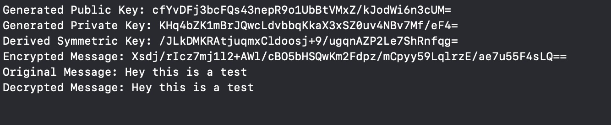

# Decentralized Messaging App (ZiiT) - Read Me

  

## Overview

ZiiT is a decentralized messaging app that uses Firebase and Stream Chat for authentication, data storage, and real-time chat functionalities. This guide will help you set up and run the project on your local machine.

## Prerequisites

Before you begin, ensure you have the following installed:

- Xcode (latest version recommended)

- CocoaPods

- Firebase CLI (optional, for Firebase functions)

- Node.js (for Firebase functions)

  

## Project Setup

  

### Step 1: Clone the Repository

Clone the repository to your local machine using Git:

```bash

git clone <https://github.com/MarvenCesar/ZiiT.git>

cd ZiiT

cd ZiiT

```

  

### Step 2: Install CocoaPods

Ensure you have CocoaPods installed. If not, install it using:

```bash

sudo gem install cocoapods

```

  

### Step 3: Install Dependencies

Navigate to the project directory and install the necessary pods:

```bash

cd ZiiT

pod install

```

  

### Step 4: Configure Firebase

1. Go to the Firebase Console and create a new project.

2. Add an iOS app to your Firebase project.

3. Download the `GoogleService-Info.plist` file and add it to your Xcode project. Ensure it is included in the target.

  

### Step 5: Firebase Functions

1. Navigate to the `functions` directory:

```bash

cd functions

```

2. Install the necessary Node.js dependencies:

```bash

npm install

```

3. Deploy the Firebase function to generate Stream tokens:

```bash

firebase deploy --only functions

```

  

### Step 6: Update API Keys

Ensure that the API keys for Stream Chat are correctly set in the `index.js` file in the Firebase functions directory and in the `AppDelegate.swift` file in the main project and simply use my API keys:

```javascript

// index.js

const apiKey = 'dtb2zae562wu';

const apiSecret = 'zhrrmsqdq3rr3s7y8jvbhvuz5u6efw89vubvvp9wpyhegbvyqfb6fj8s5bcwe7yq';

```

```swift

// AppDelegate.swift

let apiKey = "dtb2zae562wu"

```

  

### Step 7: Open the Project in Xcode

Open the `.xcworkspace` file in Xcode:

```bash

open ZiiT.xcworkspace

```

  

## Running the App

1. Select the target device (Simulator or a physical device).

2. Build and run the project using Xcode by clicking the Run button or using the shortcut `Cmd + R`.

  

## Key Features

- ****Sign Up / Log  In****: Users can sign up or sign in using their email and password.

- ****Real-time Chat****: Users can send and receive messages in real-time.

- ****Encryption****: Messages are encrypted using symmetric keys derived from public-private key pairs.

- ****Settings****: Users can sign out.

  

## File Descriptions

- ****ChatManager.swift****: Manages the chat functionalities including user authentication, message encryption/decryption, and interaction with Firestore.

- ****LoginViewController.swift****: Handles user login functionality.

- ****SignUpViewController.swift****: Handles user sign-up functionality.

- ****TabBarViewController.swift****: Manages the tab bar interface for navigating between the chat list and settings.

- ****SettingsViewController.swift****: Allows users to sign out

- ****AppDelegate.swift****: Configures Firebase and initializes the Stream Chat client.

- ****SceneDelegate.swift****: Manages the app's UI lifecycle.

  

## Troubleshooting

- Ensure all Firebase configurations are correctly set up in the Firebase Console.

- Make sure that the Stream Chat API key and secret are correctly added.

- Check for any missing dependencies and ensure they are correctly installed using CocoaPods.

- Verify network permissions in your Xcode project settings.

  

For further assistance, refer to the official documentation for [Firebase](https://firebase.google.com/docs) and [Stream Chat](https://getstream.io/chat/docs/).

  

## Encryption and Decryption

  

### Overview

ZiiT uses end-to-end encryption to secure user messages. Each user has a public-private key pair. Messages are encrypted using a symmetric key derived from the recipient's public key and the sender's private key.

  

### Key Generation

The `ChatManager` class generates a key pair using the `generateKeyPair` method:

```swift

func generateKeyPair() -> (publicKey: String, privateKey: String)?

```

This method creates a Curve25519 private key and its corresponding public key, then encodes them in base64 format for storage and transmission.

  

### Symmetric Key Derivation

A symmetric key is derived using the sender's private key and the recipient's public key:

```swift

func deriveSymmetricKey(publicKey: String, privateKey: String) -> SymmetricKey?

```

This method uses the X25519 key agreement protocol to derive a shared secret, which is then processed using HKDF to produce a 32-byte symmetric key.

  

### Message Encryption

Messages are encrypted with the symmetric key:

```swift

func encryptMessage(message: String, symmetricKey: SymmetricKey) -> Data?

```

The message string is converted to data and then encrypted using AES-GCM. The encrypted message is returned as `Data`.

  

### Message Decryption

Encrypted messages are decrypted back to plaintext:

```swift

func decryptMessage(encryptedMessage: Data, symmetricKey: SymmetricKey) -> String?

```

The encrypted data is decrypted using the symmetric key to retrieve the original message.

  

### Testing Encryption

The `LoginViewController` includes a test function to demonstrate encryption and decryption that can be viewed in terminal upon running program:

```swift

func testEncryptionDecryption() {

guard let (publicKey, privateKey) = ChatManager.shared.generateKeyPair(),

let symmetricKey = ChatManager.shared.deriveSymmetricKey(publicKey: publicKey, privateKey: privateKey) else {

print("Key generation or derivation failed")

return

}

  

let message = "This is a test"

guard let encryptedData = ChatManager.shared.encryptMessage(message: message, symmetricKey: symmetricKey) else {

print("Message encryption failed")

return

}

  

guard let decryptedMessage = ChatManager.shared.decryptMessage(encryptedMessage: encryptedData, symmetricKey: symmetricKey) else {

print("Message decryption failed")

return

}

  

print("Original Message: \(message)")

print("Decrypted Message: \(decryptedMessage)")

}

```

This function verifies that the generated keys, encryption, and decryption processes work correctly by comparing the original and decrypted messages.




  

## User Account Information

When a user creates an account, they must also create a passphrase. This passphrase is used to encrypt and decrypt their private key, ensuring secure storage and retrieval. The passphrase is not saved anywhere in the code or database for security reasons. It is entered by the user each time they need to decrypt their private key. The passphrase provided by the user is used to generate a symmetric key using a key derivation function. In this case, SHA-256 is used to hash the passphrase, producing a symmetric key. This ensures that even if the database is compromised, the private key cannot be decrypted without the user's passphrase.

  

The following data is saved in Firebase Firestore for each user:

- ****Username****: The user's chosen display name.

- ****Email****: The user's email address.

- ****Public Key****: The user's public key, used for encrypting messages.

- ****Encrypted Private Key****: The user's private key, encrypted using their passphrase for secure storage.

  

### Saving Data to Firestore

The user data is saved to Firestore during the sign-up process:

```swift

ChatManager.shared.signUp(email: email, password: password, username: username) { [weak self] success in

guard success else {

self?.showAlert(message: "Sign-up failed. Please try again.")

return

}

  

// Generate key pair

guard let (publicKey, privateKey) = ChatManager.shared.generateKeyPair() else { return }

  

// Encrypt and store private key

ChatManager.shared.encryptAndStorePrivateKey(privateKey, passphrase: passphrase, userId: Auth.auth().currentUser!.uid)

  

// Save public key in Firestore

ChatManager.shared.savePublicKey(userId: Auth.auth().currentUser!.uid, publicKey: publicKey)

  

DispatchQueue.main.async {

self?.navigationController?.popViewController(animated: true)

}

}

```

This ensures that each user's sensitive information is securely stored and managed.

  

## Troubleshooting

- Ensure all Firebase configurations are correctly set up in the Firebase Console.

- Make sure that the Stream Chat API key and secret are correctly added.

- Check for any missing dependencies and ensure they are correctly installed using CocoaPods.

- Verify network permissions in your Xcode project settings.

  

For further assistance, refer to the official documentation for [Firebase](https://firebase.google.com/docs) and [Stream Chat](https://getstream.io/chat/docs/).

  


## Disclaimer

This app is not a fully decentralized application and requires further improvements to achieve full decentralization. Due to limited resources, time, and expertise, this is the best implementation that can be provided at this time. 

### Potential Improvements for Full Decentralization

1. **Decentralized Storage**:
   - **Current Implementation**: The app currently uses Firebase Firestore for storing user data, including usernames, emails, public keys, and encrypted private keys.
   - **Improvement**: Implement decentralized storage solutions such as IPFS (InterPlanetary File System) or blockchain-based storage systems. This would eliminate the reliance on a central database and distribute the storage across multiple nodes.

2. **Decentralized Identity Management**:
   - **Current Implementation**: User authentication and identity management are handled by Firebase Authentication.
   - **Improvement**: Integrate decentralized identity frameworks that allow users to manage their identities independently without relying on a centralized authority.

3. **End-to-End Encryption**:
   - **Current Implementation**: The app uses end-to-end encryption with AES-GCM and symmetric keys derived from user-provided passphrases.
   - **Improvement**: While the current encryption approach is secure, implementing peer-to-peer encryption mechanisms that don't rely on a central server for key exchange would enhance security and decentralization.

4. **Decentralized Messaging Protocol**:
   - **Current Implementation**: Real-time messaging is facilitated by Stream Chat's centralized infrastructure.
   - **Improvement**: Utilize decentralized messaging protocols such as Matrix, Whisper (part of the Ethereum ecosystem), or Secure Scuttlebutt (SSB). These protocols enable peer-to-peer communication without relying on centralized servers.

5. **Smart Contracts for Automation**:
   - **Current Implementation**: The app does not use smart contracts.
   - **Improvement**: Implement smart contracts on platforms like Ethereum or Polkadot to automate various functions, such as user registration, key management, and message validation. Smart contracts ensure that transactions and interactions are executed transparently and without the need for a central authority.

6. **Decentralized Governance**:
   - **Current Implementation**: Governance and control are centrally managed by the app developer.
   - **Improvement**: Establish a decentralized governance model using DAO (Decentralized Autonomous Organization) frameworks. This would allow the community to participate in decision-making processes, ensuring that the app evolves based on collective input and consensus.

By addressing these areas, the app can move towards a more fully decentralized architecture, enhancing security, privacy, and user autonomy. However, achieving full decentralization is a complex and ongoing process that requires significant effort, expertise, and resources.

## Video Example

